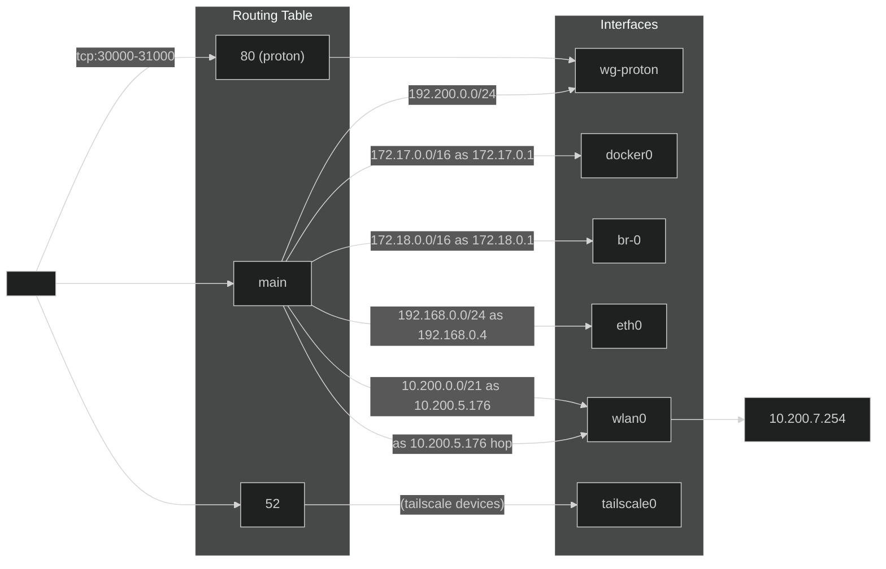

##
```
# 連絡
- 全体連絡

# 一般
- 一般
- フリーディスカッション
- 制御班
- 回路班
- 設計班

# 講習

# 役職
- インフラ
- 3 役
```

mailto:nitnc-robo-club@googlegroups.com

## robo-rpi 追加設定
```
sudo ip route add default dev wg-proton table 80
sudo ip rule add ipproto tcp dport 30000-31000 lookup 80
```
